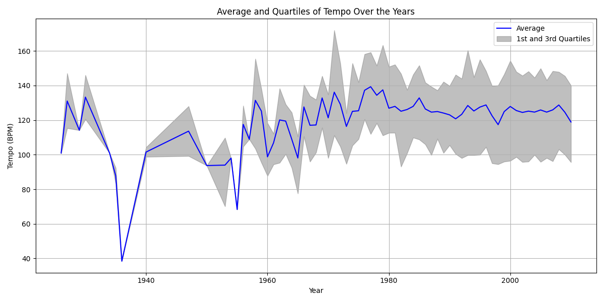

# Project Log Book
Music Genre Classification  
Aubrey McGarrah

## 9/28/23
Decide what components of a song (or *fields*, as MSD calls them) that will be looked for the experiment(?) at by using the Million Song Database [Example Track Description](http://millionsongdataset.com/pages/example-track-description/). It shows what function will be used to get that component of a song from the song file.  
  
For my project, I am only concerned about the following fields:
- song name and artist name
- artist location
- danceability
- energy
- key and key confidence
- loudness
- tempo
- time signature and time signature confidence
- year
  

  
That is how to start this project.

## 10/3/23
Besides just making a music genre classifier, it would be beneficial (and potentially fun) to analyze the data in the Million Song Dataset subset, looking for relationships between song fields.  

For example, here is a graph that shows the relationship between the tempo of a song and the year the song was released:

There doesn't seem to be a significant trend or relationship between the tempo and release year based on the graph.  

**Note: I am using the MSD subset (at least at this point). The MSD subset is a random selection of 10,000 songs (1% of the entire dataset, 1.8 GB) from the entire dataset (280 GB), so because the song files were selected at random, it may affect analytical results, graphs, etc.**  

Here are some questions I may answer:
- How does the tempo affect the genre of a song?
- How does the key signature affect the genre of a song?
- What’s the correlation between the key signature and tempo, if there is one?
- Is danceability and energy related and how?

## 10/5/23
I decided to make a program that will print a song title and the artist, so I can manually determine the genre and add it to the dictionary I have. The data in the dictionary will later be used in a neural network.

The data I need will be added to the dictionary I mentioned, and that dictionary will be added to a list. The program will later iterate over the list.

When I tried to test if the data was actually added to the list, I got an error saying that there wasn't enough memory to store all of the data, so I limited the number of songs to the first 100 songs.